## About me

I write backend systems in Java and Python, and reach for React when a project needs a front end. Most of what I build sits somewhere between security, real-time communication, and computer vision — a REST API, a WebSocket chat server, a YOLO pipeline that has to hold up against real images instead of clean test data.

## Tech stack

**Languages & backend frameworks**

    

**Frontend**

**Computer vision & AI**

**Tools**

 

## GitHub stats

## Selected projects

| Project | What it does | Stack | Status |
|---|---|---|---|
| [SymphonyProject1](https://github.com/Dhruv0306/SymphonyProject1) | Logo detection and brand validation. YOLO cascade behind a FastAPI backend, React frontend for real-time and batch image processing | `Python` `FastAPI` `React` `YOLO` | Shipped |
| [private-blockchain](https://github.com/Dhruv0306/private-blockchain) | Multi-module Spring Boot 4 blockchain app. Migrated a breaking dependency change, patched high-severity CVEs via BOM, fixed the CI Javadoc/release workflows | `Java` `Spring Boot 4` `Maven` | Active |
| [Antivirus](https://github.com/Dhruv0306/Antivirus) | Full-stack antivirus on an X.800-inspired architecture — real-time scanning, quarantine, React dashboard | `Java` `Spring Boot` `React` | Shipped |
| [cloudshare-app](https://github.com/Dhruv0306/cloudshare-app) | Secure file sharing — auth, upload/download flows, REST API, logging built in from the start | `Java` `Spring Boot` | Shipped |
| [Java-Chat-App](https://github.com/Dhruv0306/Java-Chat-App) | Real-time chat over WebSockets with active-user tracking and broadcast messaging | `Java` `WebSocket` | Shipped |
| [Virtual staining: CNN](https://github.com/Dhruv0306/deep-learning-project-virtual-staining) / [ViT](https://github.com/Dhruv0306/deep-learning-project-virtual-staining-using-transformers) | Comparing a CNN and a Vision Transformer on the same image-transformation task | `Python` `Deep learning` | Shipped |
| LangChain LinkedIn Post Writer | Multi-agent system — separate agents handle drafting, editing, and formatting instead of one pass | `Python` `LangChain` | Shipped |
| [viva-cli](https://github.com/Dhruv0306/viva-cli) | Local-LLM + RAG CLI that runs timed, oral-exam-style Q&A sessions on a codebase and produces a grounded evaluation report | `Python` `Ollama` `Chroma` | Design stage |

## Competitive programming

Mostly Java: Nim-style game theory, O(n) prefix-sum decompositions for circular arrangement problems, digit DP for adjacent-digit-difference counting on ranges up to 10¹⁵, and a minimum-adjacent-swap problem solved with a Hall's theorem feasibility check plus Fenwick tree inversion counting.

## Right now

Finishing the Spring Boot 4 migration on `private-blockchain` and designing `viva-cli`. I use Claude, ChatGPT, and Copilot for planning and documentation — not to skip writing the code myself.

## Open to contributors

[Music-through-Computer-Programming](https://github.com/Dhruv0306/Music-through-Computer-Programming) — a synthesizer, audio effect processor, and e-Sitar simulation built in JavaScript. Could use more hands.

